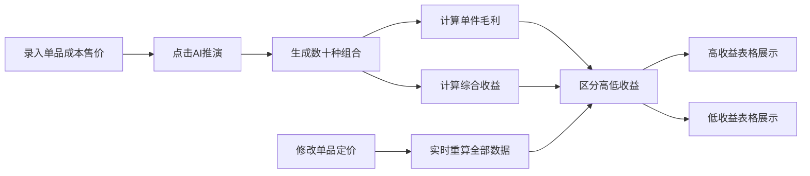

## 1. 产品概述
商品组合收益AI推演系统，为零售行业提供智能商品捆绑销售策略分析工具。通过录入零食单品的成本与售价，AI自动生成数十种组合方案并计算收益，帮助工作人员快速识别高收益搭配。

## 2. 核心功能

### 2.1 用户角色
| 角色 | 注册方式 | 核心权限 |
|------|----------|----------|
| 运营人员 | 无需注册，直接使用 | 录入商品数据、查看组合收益、调整定价验证 |

### 2.2 功能模块
1. **商品参数配置页**：单品信息录入、批量添加删除、定价调整
2. **AI组合推演区**：自动生成数十种捆绑组合、实时收益计算
3. **收益分析表格**：高低收益区分展示、单件毛利与综合收益对比

### 2.3 页面详情
| 页面名称 | 模块名称 | 功能描述 |
|---------|----------|----------|
| 参数配置页面 | 商品录入模块 | 支持添加/删除零食单品，录入成本价、售价、商品名称 |
| 参数配置页面 | AI推演控制 | 点击触发AI组合生成，可配置组合商品数量范围 |
| 参数配置页面 | 高收益表格 | 展示Top收益组合，高亮显示，按综合收益降序 |
| 参数配置页面 | 低收益表格 | 展示低收益组合，灰色标记，提示不推荐 |

## 3. 核心流程
工作人员录入零食单品的成本与售价 → 点击"AI推演"按钮 → 系统自动生成数十种捆绑售卖组合 → 计算每套组合的单件毛利与综合收益 → 页面分别展示高低收益搭配表格 → 修改任意单品定价 → 后端实时重算全部收益数据 → 表格数据自动刷新

## 4. 用户界面设计

### 4.1 设计风格
- **主色调**：深青色 #0F766E（专业、理性），搭配橙色 #F97316 作为高收益高亮
- **按钮风格**：圆角8px，渐变色填充，hover有轻微上浮效果
- **字体**：标题使用 Noto Sans SC Bold，正文使用 Noto Sans SC Regular
- **布局风格**：左右分栏布局，左侧商品配置区，右侧收益分析区
- **图标风格**：使用简洁线性图标，高收益使用向上箭头，低收益使用向下箭头

### 4.2 页面设计概述
| 页面名称 | 模块名称 | UI元素 |
|---------|----------|--------|
| 参数配置页面 | 商品录入区 | 卡片式表单，输入框带单位标注，动态增删按钮 |
| 参数配置页面 | 推演控制区 | 大号AI推演按钮，组合数量滑块配置 |
| 参数配置页面 | 高收益表格 | 橙色表头，斑马纹，数据行hover背景变化 |
| 参数配置页面 | 低收益表格 | 灰色表头，半透明文字，降低视觉权重 |

### 4.3 响应式
- 桌面端（>1280px）：左右分栏布局，左侧40%，右侧60%
- 平板端（768px-1280px）：上下堆叠布局
- 移动端（<768px）：单列布局，表格支持横向滚动

### 4.4 动效设计
- 页面加载：元素从下往上淡入，错峰延迟
- 数据刷新：表格数字滚动过渡效果
- 按钮点击：缩放反馈 0.98 → 1.0
- 实时计算：加载状态骨架屏动画
