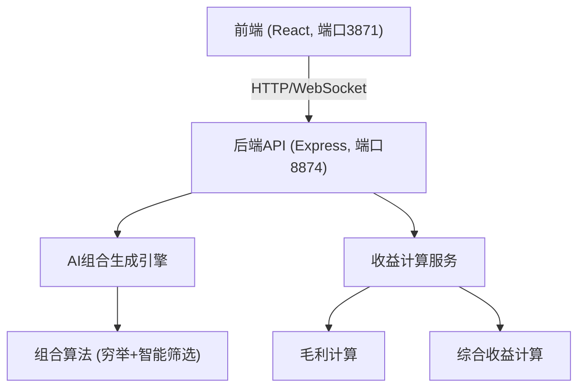
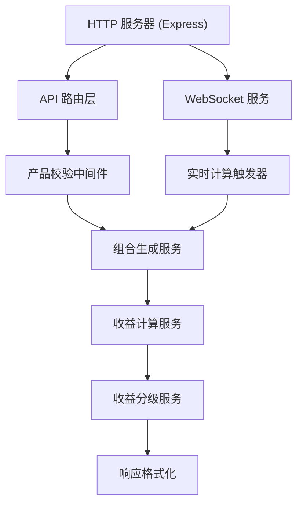

## 1. 架构设计


## 2. 技术描述
- **前端**：React@18 + TypeScript + Vite + tailwindcss@3
- **初始化工具**：vite-init
- **后端**：Express@4 + Node.js
- **通信协议**：HTTP REST API + WebSocket 实时推送
- **数据存储**：内存存储（无需数据库，运行时计算）

## 3. 路由定义
| 路由 | 用途 |
|------|------|
| / | 商品参数配置主页面 |

## 4. API 定义

### 4.1 类型定义
```typescript
interface Product {
  id: string;
  name: string;
  cost: number;
  price: number;
}

interface Combination {
  id: string;
  products: Product[];
  totalCost: number;
  totalPrice: number;
  unitProfit: number;
  totalProfit: number;
  profitMargin: number;
}

interface CalculationResult {
  highProfit: Combination[];
  lowProfit: Combination[];
  timestamp: number;
}
```

### 4.2 API 接口

#### POST /api/calculate
**请求体**：
```typescript
{
  products: Product[];
  minComboSize?: number;
  maxComboSize?: number;
}
```

**响应**：
```typescript
{
  success: boolean;
  data: CalculationResult;
}
```

#### WebSocket /ws/realtime
用于修改商品定价后实时推送重算结果

## 5. 服务器架构图


## 6. 核心算法设计

### 6.1 组合生成算法
- 输入：N个商品，组合大小范围 [min, max]
- 输出：所有可能的非空子集（排除单商品组合）
- 智能筛选：当组合数超过50时，按毛利率优先级筛选Top 50

### 6.2 收益计算公式
- 单件毛利 = 售价 - 成本
- 综合收益 = Σ(组合内各商品毛利)
- 毛利率 = 综合收益 / 组合总售价 × 100%

### 6.3 高低收益区分
- 高收益：毛利率 ≥ 35% 或 综合收益 ≥ 10元
- 低收益：毛利率 < 35% 且 综合收益 < 10元
